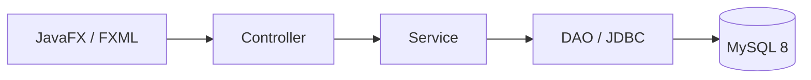

# UniVote

## Descripción

UniVote es una aplicación de escritorio para gestionar la participación en votaciones universitarias. El MVP ofrece autenticación institucional, consulta de procesos electorales, selección informada de candidaturas, emisión controlada del voto y comprobación posterior, manteniendo separadas la identidad del votante y la candidatura elegida en el modelo de datos.

## Funcionalidades

- Inicio de sesión por documento o correo con verificación BCrypt.
- Carga de usuario, rol y permisos; sesión inmutable en memoria.
- Elecciones activas dentro de su periodo y candidaturas habilitadas.
- Confirmación y registro exclusivo mediante `sp_registrar_voto`.
- Comprobante sin identidad ni candidatura y copia al portapapeles.
- Verificación mediante `sp_verificar_voto` sin revelar la intención.
- Resultados mediante `sp_consultar_resultados`, disponibles solo para elecciones `FINALIZADA` cuya fecha de cierre haya pasado.

Quedan fuera del MVP los CRUD administrativos, gestión de elecciones/candidatos, recuperación de contraseña, persistencia de sesiones, notificaciones completas, auditoría avanzada, exportaciones y despliegue productivo.

## Arquitectura

La aplicación usa MVC complementado con Service y DAO. Las dependencias se construyen manualmente una vez, los controladores reciben servicios por constructor y la navegación carga FXML mediante classpath. JDBC permanece en los DAO y las reglas de autorización/publicación en los servicios. MySQL encapsula las operaciones electorales sensibles en procedimientos almacenados.



Un executor daemon compartido mantiene las operaciones JDBC fuera del JavaFX Application Thread y se cierra al finalizar la aplicación.

## Tecnologías

- Java 25 y codificación UTF-8.
- JavaFX 25.0.2 con FXML y CSS.
- Maven Wrapper 3.9.12.
- MySQL 8 y Connector/J 9.7.0.
- BCrypt 0.10.2.
- JUnit Jupiter 5.13.4.

## Estructura del proyecto

```text
config/                 Configuración local y plantilla
database/delivered/     Script SQL entregado
docs/                   Arquitectura, seguridad y checklist manual
src/main/java/          Aplicación, controladores, servicios, DAO y modelos
src/main/resources/     FXML, CSS y configuración visual
src/test/java/          Pruebas unitarias e integraciones opt-in
```

## Requisitos

- JDK 25.
- MySQL 8 con acceso local.
- Bash en Linux/macOS o Windows con `mvnw.cmd`.
- No es necesario instalar Maven ni JavaFX: el Wrapper y Maven resuelven las versiones declaradas.

## Configuración

Copie la plantilla sin incluir después el archivo local en Git:

```bash
cp config/application.example.properties config/application-local.properties
chmod 600 config/application-local.properties
```

Sustituya únicamente los marcadores locales. `config/application-local.properties` está ignorado y nunca debe compartirse. Las variables `UNIVOTE_DB_*` pueden sobrescribir sus valores; `-Dunivote.config.path` selecciona una ruta externa explícita.

## Base de datos

La base esperada es `votacion_universitaria`. El script entregado está en `database/delivered/Proyecto_votacion_universitaria.sql` y debe cargarse manualmente en un entorno local autorizado, sin modificarlo.

> Advertencia: el script elimina y recrea la base local. Revíselo y asegúrese de no apuntar a un entorno con datos que deban conservarse.

El contenido demostrativo del script no debe reutilizarse como credencial real.

## Usuario técnico

Use un usuario MySQL dedicado con mínimo privilegio: `SELECT` solo sobre columnas necesarias y `EXECUTE` sobre los procedimientos requeridos. No conceda acceso administrativo, `ALL PRIVILEGES` ni escritura directa sobre `votos` o `control_votacion`. La contraseña pertenece exclusivamente a la configuración local externa.

## Ejecución

```bash
./mvnw --no-transfer-progress \
  -Dunivote.config.path=config/application-local.properties \
  javafx:run
```

La aplicación abre en el login y solo conecta a MySQL al iniciar una operación que lo requiere.

## Pruebas

Suite normal, independiente de MySQL:

```bash
./mvnw --no-transfer-progress clean test
```

Integraciones JDBC opt-in:

```bash
./mvnw --no-transfer-progress \
  -Dunivote.integration.database=true \
  -Dunivote.config.path=config/application-local.properties \
  test
```

Las integraciones verifican conexión, lecturas y procedimientos de consulta. Ninguna registra votos automáticamente. La prueba de resultados se omite si no existe una elección finalizada publicable.

## Seguridad y privacidad

- Contraseñas verificadas con BCrypt y arreglos de contraseña limpiados tras cada intento.
- Secretos externos, permisos mínimos y conexiones por operación.
- Autorización en Service mediante permisos, no por nombre de rol.
- Registro del voto exclusivamente mediante procedimiento almacenado.
- Tablas separadas para participación e intención; no se afirma anonimato criptográfico.
- Comprobante sin candidatura ni identidad y sin códigos en logs.
- Resultados bloqueados hasta estado `FINALIZADA` y fecha de cierre alcanzada.

## Flujo principal

```text
Login → Elección → Candidatura → Confirmación → Voto → Comprobante
```

Desde el dashboard también se accede a verificación de comprobantes y resultados publicados.

## Estado del proyecto

**MVP funcional para entorno académico y demostrativo.** Requiere validación operativa, endurecimiento y revisión institucional antes de cualquier elección de alta criticidad.

## Autoría

Proyecto identificado por el paquete y `groupId` verificables `io.github.jhonpoved01`.

## Licencia

Este repositorio no tiene una licencia pública definida actualmente.
